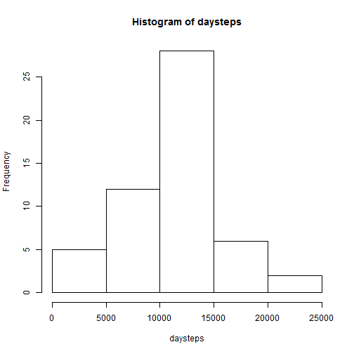
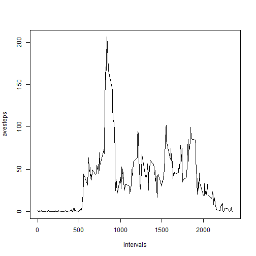
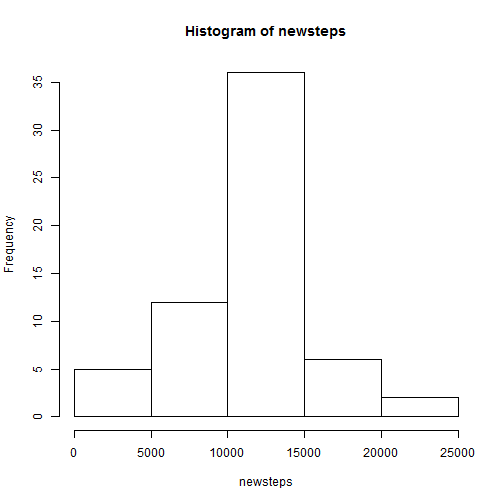
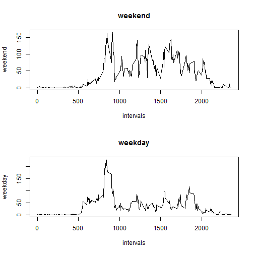

## Peer Assessment 1

## Loading and preprocessing the data

Show any code that is needed to

1. Load the data (i.e. read.csv())


```r
data <- read.csv("activity.csv")
```

2. Process/transform the data (if necessary) into a format suitable for your analysis

a. Create a vector of dates to use for summing the number of steps per day


```r
dates <- dimnames(table(data[,"date"]))[[1]]
```

b. Create a vector of steps taken per day


```r
daysteps <- NULL
for (i in 1:length(dates)) {
 daysteps <- c(daysteps, sum(data[data[,"date"]==dates[i],"steps"])) 
}
```

c. Create time series of average and median numbers of steps across each five-minute interval


```r
intervals <- dimnames(table(data[,"interval"]))[[1]]
averages <- NULL
for (i in 1:length(intervals)) {
  averages <- c(averages, mean(data[data[,"interval"]==intervals[i],"steps"], na.rm = TRUE))
}
avesteps <- as.ts(averages)
```

## What is mean total number of steps taken per day?

For this part of the assignment, you can ignore the missing values in the dataset.

1. Make a histogram of the total number of steps taken each day


```r
hist(daysteps)
```

 

2. Calculate and report the mean and median total number of steps taken per day


```r
mean(daysteps,na.rm = TRUE)
```

```
## [1] 10766.19
```

```r
median(daysteps,na.rm = TRUE)
```

```
## [1] 10765
```

## What is the average daily activity pattern?

1. Make a time series plot (i.e. type = "l") of the 5-minute interval (x-axis) and the average number of steps taken, averaged across all days (y-axis)


```r
plot(intervals,avesteps,type = "l")
```

 

2. Which 5-minute interval, on average across all the days in the dataset, contains the maximum number of steps?


```r
intervals[which(avesteps==max(avesteps))]
```

```
## [1] "835"
```

## Imputing missing values

Note that there are a number of days/intervals where there are missing values (coded as NA). The presence of missing days may introduce bias into some calculations or summaries of the data.

1. Calculate and report the total number of missing values in the dataset (i.e. the total number of rows with NAs)


```r
length(data[which(is.na(data[,"steps"])),"steps"])
```

```
## [1] 2304
```

2. Devise a strategy for filling in all of the missing values in the dataset. The strategy does not need to be sophisticated. For example, you could use the mean/median for that day, or the mean for that 5-minute interval, etc.

a. Create a vector of row indexes to the missing values of "steps"


```r
stepindx <- which(is.na(data[,"steps"]))
```

b. For each row of the new dataset with a missing "steps" value, replace NA with the mean for the corresponding 5-minute interval

3. Create a new dataset that is equal to the original dataset but with the missing data filled in.


```r
newdata <- data
for (i in 1:length(stepindx)){
  newdata[stepindx[i],"steps"] <- avesteps[which(newdata[stepindx[i],"interval"]==intervals)]  
}
```

4. Make a histogram of the total number of steps taken each day and calculate and report the mean and median total number of steps taken per day. Do these values differ from the estimates from the first part of the assignment? What is the impact of imputing missing data on the estimates of the total daily number of steps?

a. Calculate steps per day for the new data


```r
newsteps <- NULL
for (i in 1:length(dates)) {
 newsteps <- c(newsteps, sum(newdata[newdata[,"date"]==dates[i],"steps"])) 
}
```

b. Make a histogram and compute mean and median for total number of steps taken per day after imputing missing values


```r
hist(newsteps)
```

 

```r
mean(newsteps)
```

```
## [1] 10766.19
```

```r
median(newsteps)
```

```
## [1] 10766.19
```

Conclusion: Replacing missing values with the mean number of steps for the corresponding interval has little effect on the distribution and results in equal values of the mean and median numbers of steps per day

## Are there differences in activity patterns between weekdays and weekends?

For this part the weekdays() function may be of some help here. Use the dataset with the filled-in missing values for this part.

1. Create a new factor variable in the dataset with two levels - "weekday" and "weekend" indicating whether a given date is a weekday or weekend day.

a. Determine the day of the week for each observation in the data


```r
dayofweek <- weekdays(as.Date(newdata[,"date"]))
```

b. Define the two-level factor variable


```r
levels <- c("Sunday","Monday","Tuesday","Wednesday","Thursday","Friday","Saturday")
labels <- c("weekend", "weekday", "weekday", "weekday", "weekday", "weekday", "weekend") 
dayfact <- factor(dayofweek, levels, labels)
```

```
## Warning in `levels<-`(`*tmp*`, value = if (nl == nL) as.character(labels)
## else paste0(labels, : duplicated levels in factors are deprecated
```

2. Make a panel plot containing a time series plot (i.e. type = "l") of the 5-minute interval (x-axis) and the average number of steps taken, averaged across all weekday days or weekend days (y-axis). See the README file in the GitHub repository to see an example of what this plot should look like using simulated data.

a. Create average numbers of steps taken at each 5-minute interval for weekdays and for weekend days


```r
wkdaydta <- newdata[which(dayfact=="weekday"),]
wkenddta <- newdata[which(dayfact=="weekend"),]

# intervals <- dimnames(table(data[,"interval"]))[[1]]
wkdayave <- NULL
wkendave <- NULL
for (i in 1:length(intervals)) {
  wkdayave <- c(wkdayave, mean(wkdaydta[wkdaydta[,"interval"]==intervals[i],"steps"]))
  wkendave <- c(wkendave, mean(wkenddta[wkenddta[,"interval"]==intervals[i],"steps"]))
}
weekday <- as.ts(wkdayave)
weekend <- as.ts(wkendave)
```

b. Create panel plot comparing the weekend and weekday averages

X-label: Interval
y-label: Number of steps
top: weekend
bottom: weekday


```r
# 2 figures arranged in 2 rows
par(mfrow=c(2,1))
plot(intervals,weekend,main="weekend",type = "l")
plot(intervals,weekday,main="weekday",type = "l")
```

 
